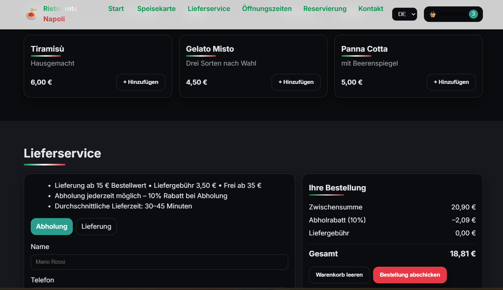

# Ristorante Napoli – Restaurant‑Website (DE/EN/IT) mit Online‑Bestellung & Lieferservice

Eine moderne, mehrsprachige Restaurant‑Website mit **Online‑Bestellung**, **Warenkorb**, **Abholung/Lieferung** (Mindestbestellwert, Liefergebühr & Abhol‑Rabatt), optionalem **PayPal‑Checkout**, **Dark Mode**, **SEO (Schema.org/JSON‑LD)** und **Barrierefreiheit (ARIA)**.  
Technologien: **HTML5 · CSS3 · Vanilla JS**

### Screenshot (mit Daten)

---

## Features
- **Online‑Bestellung** mit Warenkorb, Abhol‑/Liefer‑Umschalter, Abhol‑Rabatt (10 %), Liefergebühr (3,50 €) und Mindestbestellwert (15 €)
- **Mehrsprachig (DE/EN/IT)** via Language‑Switcher, Auswahl wird im `localStorage` gespeichert
- **Responsives UI** (mobil‑freundlich), **Dark‑Mode**, **tastatur‑bedienbar** und ARIA‑Labels
- **PayPal‑Integration** (optional; Sandbox eingebunden – Client‑ID einfach austauschen)
- **SEO**: Meta‑Tags & [Schema.org](https://schema.org) **Restaurant** via JSON‑LD
- Saubere **Code‑Struktur** (HTML/CSS/JS getrennt), leicht anpassbar

---

**Bestelllogik:**  
- Mindestbestellwert Lieferung: **15,00 €**  
- Liefergebühr: **3,50 €**, entfällt ab **35,00 €**  
- Abholung: **10 % Rabatt** auf die Zwischensumme

> Diese Werte sind in `script.js` (Konstanten `MIN_DELIVERY`, `DELIVERY_FEE`, `PICKUP_DISCOUNT`) hinterlegt.

---

## Internationalisierung (i18n)
- Sprach‑Strings in `script.js` unter `i18n.de`, `i18n.en`, `i18n.it`
- UI‑Texte im HTML sind mit `data-i18n`/`data-i18n-placeholder` markiert
- Sprache wird im `localStorage` persistiert (`lang`)
